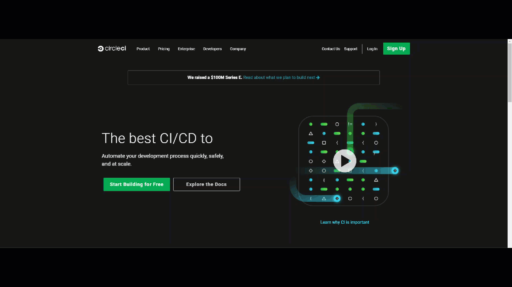

# Get Zulip code

Zulip uses a **forked-repo** and **[rebase][gitbook-rebase]-oriented
workflow.**. This means that all contributors create a fork of the [Zulip
repository][github-zulip] they want to contribute to and then submit pull
requests to the upstream repository to have their contributions reviewed and
accepted. We also recommend you work on feature branches.

## Step 1a: Create your fork

The following steps you'll only need to do the first time you setup a machine
for contributing to a given Zulip project. You'll need to repeat the steps for
any additional Zulip projects ([list][github-zulip]) that you work on.

The first thing you'll want to do to contribute to Zulip is fork ([see
how][github-help-fork]) the appropriate [Zulip repository][github-zulip]. For
the main server app, this is [zulip/zulip][github-zulip-zulip].

## Step 1b: Clone to your machine

Next, clone your fork to your local machine:

```
$ git clone --config pull.rebase https://github.com/YOUR_USERNAME/zulip.git
Cloning into 'zulip'
remote: Counting objects: 86768, done.
remote: Compressing objects: 100% (15/15), done.
remote: Total 86768 (delta 5), reused 1 (delta 1), pack-reused 86752
Receiving objects: 100% (86768/86768), 112.96 MiB | 523.00 KiB/s, done.
Resolving deltas: 100% (61106/61106), done.
Checking connectivity... done.
```

(The `--config pull.rebase` option configures Git so that `git pull`
will behave like `git pull --rebase` by default.  Using `git pull
--rebase` to update your changes to resolve merge conflicts is
expected by essentially all of open source projects, including Zulip.
You can also set that option after cloning using `git config --add
pull.rebase true`, or just be careful to always run `git pull
--rebase`, never `git pull`).

Note: If you receive an error while cloning, you may not have [added your ssh
key to GitHub][github-help-add-ssh-key].

Once the repository is cloned, we recommend running
[setup-git-repo][zulip-rtd-tools-setup] to install Zulip's pre-commit
hook which runs the Zulip linters on the changed files when you
commit.

## Step 1c: Connect your fork to Zulip upstream

Next you'll want to [configure an upstream remote
repository][github-help-conf-remote] for your fork of Zulip. This will allow
you to [sync changes][github-help-sync-fork] from the main project back into
your fork.

First, show the currently configured remote repository:

```
$ git remote -v
origin  git@github.com:YOUR_USERNAME/zulip.git (fetch)
origin  git@github.com:YOUR_USERNAME/zulip.git (push)
```

Note: If you've cloned the repository using a graphical client, you may already
have the upstream remote repository configured. For example, when you clone
[zulip/zulip][github-zulip-zulip] with the GitHub desktop client it configures
the remote repository `zulip` and you see the following output from `git remote
-v`:

```
origin  git@github.com:YOUR_USERNAME/zulip.git (fetch)
origin  git@github.com:YOUR_USERNAME/zulip.git (push)
zulip    https://github.com/zulip/zulip.git (fetch)
zulip    https://github.com/zulip/zulip.git (push)
```

If your client hasn't automatically configured a remote for zulip/zulip, you'll
need to with:

```
$ git remote add -f upstream https://github.com/zulip/zulip.git
```

Finally, confirm that the new remote repository, upstream, has been configured:

```
$ git remote -v
origin  git@github.com:YOUR_USERNAME/zulip.git (fetch)
origin  git@github.com:YOUR_USERNAME/zulip.git (push)
upstream https://github.com/zulip/zulip.git (fetch)
upstream https://github.com/zulip/zulip.git (push)
```

## Step 2: Set up the Zulip development environment

If you haven't already, now is a good time to install the Zulip development environment
([overview][zulip-rtd-dev-overview]). If you're new to working on Zulip or open
source projects in general, we recommend following our [detailed guide for
first-time contributors][zulip-rtd-dev-first-time].

## Step 3: Configure continuous integration for your fork

This step is optional, but recommended.

The Zulip Server project is configured to use [Circle CI][circle-ci]
and [Travis CI][travis-ci] to test and create builds upon each new commit
and pull request. CircleCI is the primary CI that runs frontend and backend
tests across a wide range of Ubuntu distributions. Travis CI is used only for
running the end-to-end production installer test.

CircleCI and Travis CI are free for open source projects and it's easy to
configure for your own fork of Zulip. After doing so, CircleCI and Travis
CI will run tests for new refs you push to GitHub and email you the outcome
(you can also view the results in the web interface).

Running CI against your fork can help save both your and the
Zulip maintainers time by making it easy to test a change fully before
submitting a pull request.  We generally recommend a worfklow where as
you make changes, you use a fast edit-refresh cycle running individual
tests locally until your changes work.  But then once you've gotten
the tests you'd expect to be relevant to your changes working, push a
branch to run the full test suite in CircleCI and Travis CI before
you create a pull request.  While you wait for CircleCI and Travis CI
to run, you can start working on your next task.  When the tests finish,
you can create a pull request that you already know passes the tests.

### Setup CircleCI

First, sign in to [Circle CI][circle-ci] with your GitHub account and authorize
CircleCI to access your GitHub account and repositories. Once you've logged
in click on **Add Projects** in right sidebar. This will list all your GitHub
repositories. Now goto the row of Zulip and click on **Set Up Project**.


### Setup Travis CI

First, sign in to [Travis CI][travis-ci] with your GitHub account and authorize
Travis CI to access your GitHub account and repositories. Once you've done
this, Travis CI will fetch your repository information and display it on your
[profile page][travis-ci-profile]. From there you can enable integration with
Zulip.


[gitbook-rebase]: https://git-scm.com/book/en/v2/Git-Branching-Rebasing
[github-help-add-ssh-key]: https://help.github.com/en/articles/adding-a-new-ssh-key-to-your-github-account
[github-help-conf-remote]: https://help.github.com/en/articles/configuring-a-remote-for-a-fork
[github-help-fork]: https://help.github.com/en/articles/fork-a-repo
[github-help-sync-fork]: https://help.github.com/en/articles/syncing-a-fork
[github-zulip]: https://github.com/zulip/
[github-zulip-zulip]: https://github.com/zulip/zulip/
[travis-ci]: https://travis-ci.org/
[circle-ci]:https://circleci.com/
[travis-ci-profile]: https://travis-ci.org/profile
[zulip-rtd-dev-first-time]: ../development/setup-vagrant.md
[zulip-rtd-dev-overview]: ../development/overview.md
[zulip-rtd-tools-setup]: ../git/zulip-tools.html#set-up-git-repo-script
