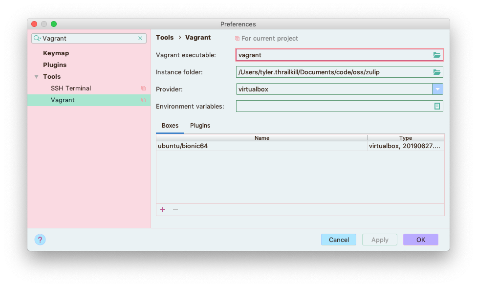
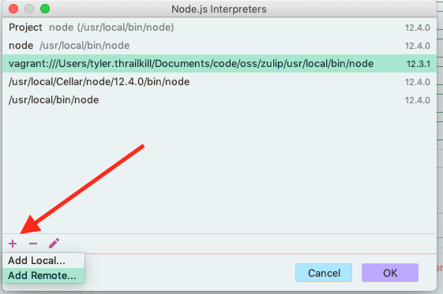
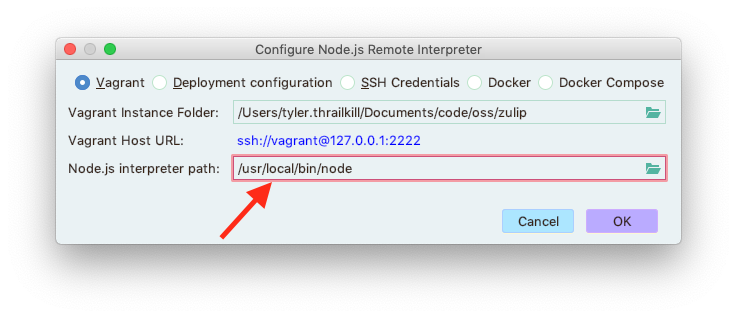

# JavaScript/TypeScript unit tests

Our node-based unit tests system is the preferred way to test
JavaScript/TypeScript code in Zulip.  We prefer it over the [Casper
black-box whole-app testing](../testing/testing-with-casper.html),
system since it is much (>100x) faster and also easier to do correctly
than the Casper system.

You can run tests as follow:
```
    tools/test-js-with-node
```

The JS unit tests are written to work with node.  You can find them
in `frontend_tests/node_tests`.  Here is an example test from
`frontend_tests/node_tests/stream_data.js`:

```
(function test_get_by_id() {
    stream_data.clear_subscriptions();
    var id = 42;
    var sub = {
        name: 'Denmark',
        subscribed: true,
        color: 'red',
        stream_id: id
    };
    stream_data.add_sub('Denmark', sub);
    sub = stream_data.get_sub('Denmark');
    assert.equal(sub.color, 'red');
    sub = stream_data.get_sub_by_id(id);
    assert.equal(sub.color, 'red');
}());
```

The names of the node tests generally align with the names of the
modules they test.  If you modify a JS module in `static/js` you should
see if there are corresponding test in `frontend_tests/node_tests`.  If
there are, you should strive to follow the patterns of the existing tests
and add your own tests.

## How the node tests work

Unlike the [casper unit tests](../testing/testing-with-casper.html),
which use the `phantomjs` browser connected to a running Zulip
deveopment server, our node unit tests don't have a browser, don't
talk to a server, and generally don't use a complete virtual DOM (a
handful of tests use the `jsdom` library for this purpose) because
those slow down the tests a lot, and often don't add much value.

Instead, the preferred model for our unit tests is to mock DOM
manipulations (which in Zulip are almost exclusively done via
`jQuery`) using a custom library
[zjquery](https://github.com/zulip/zulip/blob/master/frontend_tests/zjsunit/zjquery.js).

The
[unit test file](https://github.com/zulip/zulip/blob/master/frontend_tests/node_tests/zjquery.js)
for `zjquery` is designed to be also serve as nice documentation for
how to use `zjquery`, and is **highly recommended reading** for anyone
working on or debugging the Zulip node tests.

Conceptually, the `zjquery` library provides minimal versions of most
`jQuery` DOM manipulation functions, and has a convenient system for
letting you setup return values for more complex functions.  For
example, if the code you'd like to test calls `$obj.find()`, you can
use `$obj.set_find_results(selector, $value)` to setup `zjquery` so
that calls to `$obj.find(selector)` will return `$value`. See the unit
test file for details.

This process of substituting `jQuery` functions with our own code for
testing purposes is known as "stubbing". `zjquery` does not stub all
possible interactions with the dom, as such, you may need to write out
the stub for a function you're calling in your patch. Typically the stub
is just placed in the test file, to prevent bloating of `zjquery`
with functions that are only used in a single test.

If you need to stub, you will see an error of this form:
`Error: You must create a stub for $("#foo").bar`

The `zjquery` library itself is only about 500 lines of code, and can
also be a useful resource if you're having trouble debugging DOM
access in the unit tests.

It is typically a good idea to figure out how to stub a given function
based on how other functions have been stubbed in the same file.

## Handling dependencies in unit tests

The other big challenge with doing unit tests for a JavaScript project
is that often one wants to limit the scope the production code being
run, just to avoid doing extra setup work that isn't relevant to the
code you're trying to test.  For that reason, each unit test file
explicitly declares all of the modules it depends on, with a few
different types of declarations depending on whether we want to:

-   Exercise the module's real code for deeper, more realistic testing?
-   Stub out the module's interface for more control, speed, and
    isolation?
-   Do some combination of the above?

For all the modules where you want to run actual code, add statements
like the following toward the top of your test file:

>     zrequire('util');
>     zrequire('stream_data');
>     zrequire('Filter', 'js/filter');

For modules that you want to completely stub out, use a pattern like
this:

>     set_global('page_params', {
>         email: 'bob@zulip.com'
>     });
>
>     // then maybe further down
>     page_params.email = 'alice@zulip.com';

One can similarly stub out functions in a module's exported interface
with either `noop` functions or actual code.

Finally, there's the hybrid situation, where you want to borrow some
of a module's real functionality but stub out other pieces. Obviously,
this is a pretty strong code smell that the other module might be
lacking in cohesion, but sometimes it's not worth going down the
rabbit hole of trying to improve that. The pattern here is this:

>     // Import real code.
>     zrequire('narrow_state');
>
>     // And later...
>     narrow_state.stream = function () {
>         return 'office';
>     };

## Creating new test modules

The test runner (`index.js`) automatically runs all .js files in the
`frontend_tests/node directory`, so you can simply start editing a file
in that directory to create a new test.

The nodes tests rely on JS files that use the module pattern. For example, to
test the `foobar.js` file, you would first ensure that code like below
is at the bottom of `foobar.js`:

>     if (typeof module !== 'undefined') {
>         module.exports = foobar;
>     }

This means `foobar.js` follow the CommonJS module pattern, so it can be
required in Node.js, which runs our tests.

## Coverage reports

You can automatically generate coverage reports for the JavaScript unit
tests like this:

```
    tools/test-js-with-node --coverage
```

If tests pass, you will get instructions to view coverage reports
in your browser.

Note that modules that we don't test *at all* aren't listed in the
report, so this tends to overstate how good our overall coverage is,
but it's accurate for individual files. You can also click a filename
to see the specific statements and branches not tested. 100% branch
coverage isn't necessarily possible, but getting to at least 80%
branch coverage is a good goal.

The overall project goal is to get to 100% node test coverage on all
data/logic modules (UI modules are lower priority for unit testing).

# Debugging

It is possible to debug tests using WebStorm
First make sure that you have set up Vagrant in WebStorm by following [this guide](https://www.jetbrains.com/help/webstorm/vagrant-support.html?section=Windows%20or%20Linux)

## Set up Vagrant in Webstorm

After following the guide above your configuration should look something like this:



Navigate to Preferences then Tools then the Vagrant section.

* `Vagrant executable` should be `vagrant` (this should be autodetected)
* `Instance folder` should be your _local document `zulip` root_ (where the Vagrantfile is located)
* `Provider` should be `virtualbox` on macOS and Docker on Linux
* `Environment Variables` does not need to be set by default
* `Boxes` should have only one option in it, unless you use VirtualBox for other things, in which case choose the one that is being used for Zulip

## Setting up a Debug Configuration

You'll now need to set up a Debug Configuration. 

* Open up the Run/Debug Configuration and create a new `Node.js` config. 
* Under `Node interpreter:` click the 3 dots to the right side and click on the little plus in the bottom left of the `Node.js Interpreters` window.
  * Select `Add Remote...` 
  * In the `Configure Node.js Remote Interpreter` window select `Vagrant`
  * Set `Vagrant Instance Folder` to the root `zulip` folder where the `Vagrantfile` is located. This should set automatically.
  * Wait for WebStorm to connect to Vagrant. This will be symbolized by the `Vagrant Host URL` section containing the Vagrant SSH url. It will be something like `ssh://vagrant@127.0.0.1:2222`
  * **Set the `Node.js interpreter path` to `/usr/local/bin/node`**
  * Hit `OK` 2 times to get back to the `Run/Debug Configurations` window





* Under `Working Directory` make sure the root `zulip` directory is chosen
* Under `JavaScript file` make sure the `frontend_tests/zjsunit/index.js` file is chosen. **This is very important**
* Under `Application parameters` choose your file that you are trying to test.
* Under `Path Mappings` make sure that the Project Root is pointing to `/srv/zulip` in Vagrant. 
